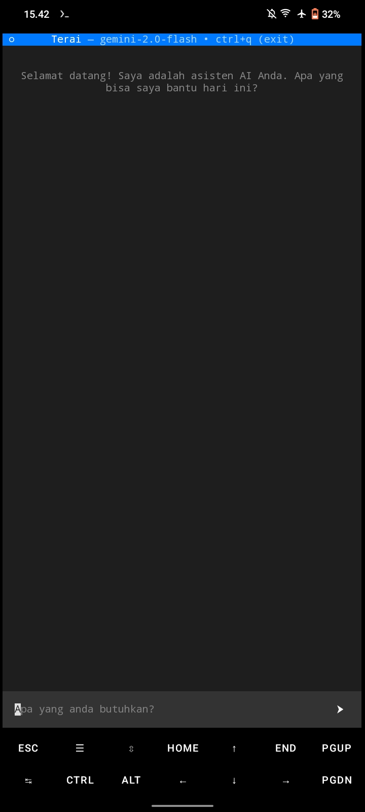

# Terai

Terminal AI adalah aplikasi chat berbasis command-line yang menggunakan Google Gemini API untuk memberikan pengalaman chatting yang interaktif dan intelligent.

## ✨ Fitur

- 💬 Chat interaktif dengan AI
- 🧠 Menggunakan Google Gemini API
- 💾 History percakapan
- 🚀 Response streaming real-time
- ⚙️ Konfigurasi mudah

## Screenshot



## 🚀 Instalasi

### 1. Clone Repository

```bash
git clone https://github.com/aidomx/terai.git
cd terai
```

### 2. Setup Environment

```bash
# Buat virtual environment
python -m venv aienv

# Aktifkan virtual environment
# Windows:
aienv\Scripts\activate
# Linux/macOS:
source aienv/bin/activate
```

### 3. Install Dependencies

```bash
pip install -r requirements.txt
```

### 4. Setup API Key

```bash
# Export API key
export GEMINI_API_KEY="your-api-key-here"
export OPENAI_API_KEY="your-api-key-here"

# Atau buat file .env
cp .env.example .env
# Edit file .env dan masukkan API key Anda
```

### Penggunaan

Jalankan aplikasi:

```bash
python main.py
```

Ketik pesan Anda dan AI akan merespons. Ketik quit untuk keluar.

### 🔧 Konfigurasi

**Google Gemini**

Dapatkan API key gratis dari [Google AI Studio](https://ai.google.dev/gemini-api/docs?hl=id)

**OpenAI**

Dapatkan API key dari [OpenAI](https://platform.openai.com/api-keys) Platform

### 🤝 Kontribusi

Pull request dipersilakan! Untuk perubahan besar, buka issue terlebih dahulu.

### 📝 License

MIT License - lihat file [LICENSE](https://github.com/aidomx/terai/blob/main/LICENSE) untuk detailnya.
